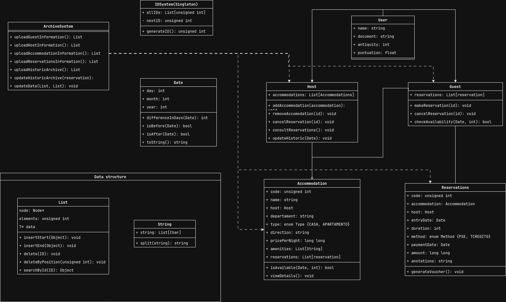

## Análisis del Problema

El problema consiste en desarrollar un sistema de gestión para un mercado de estadías hogareñas llamado UdeAStay, utilizando programación orientada a objetos en C++. El sistema debe permitir la administración de alojamientos, reservaciones, anfitriones y huéspedes.

### Entidades Principales:

1. **Alojamientos** (clase Accommodation): Representan casas o apartamentos con características como nombre, código, ubicación, precio, amenidades y disponibilidad.
2. **Reservaciones** (clase Reservations): Registran las fechas de estadía, duración, información del huésped, método de pago y anotaciones.
3. **Usuarios** (clase User): Representación abstracta de los usuarios del sistema.
    - **Anfitriones** (clase Host): Gestionan uno o más alojamientos.
    - **Huéspedes** (clase Guest): Pueden realizar reservaciones en los alojamientos.
4. **Sistema de archivo** (clase ArchiveSystem): Para la persistencia de datos.

### Funcionalidades clave:

- Carga y actualización de datos desde/hacia almacenamiento permanente
- Inicio de sesión según perfil (huésped o anfitrión)
- Reserva de alojamientos con búsqueda por criterios
- Anulación de reservaciones
- Consulta de reservaciones para anfitriones
- Actualización de histórico de reservaciones
- Medición de consumo de recursos (iteraciones y memoria)

## Consideraciones

### Estructura de Datos

Se ha optado por utilizar implementaciones propias de estructuras de datos en lugar de la STL, como solicita el enunciado:

- **Lista Genérica**: Implementamos una estructura de datos `List<T>` que permite almacenar cualquier tipo de objeto de forma dinámica.
- **String Personalizada**: Para manejar cadenas de caracteres sin depender de `std::string`.

### Arquitectura del Sistema

El diseño sigue el patrón de Arquitectura en Capas:

- **Capa de Datos**: Gestiona la persistencia (ArchiveSystem)
- **Capa de Lógica de Negocio**: Implementa las reglas de negocio y operaciones (clases User, Host, Guest, Accommodation, Reservations)
- **Capa de Presentación**: Interfaces de usuario (no representada explícitamente en el diagrama)

### Gestión de IDs

Se implementa un sistema de generación de IDs único mediante un Singleton (IDSystem) para garantizar que no haya duplicados.

### Manejo de Fechas

La clase Date encapsula la lógica de fechas, permitiendo comparaciones y cálculos necesarios para la gestión de disponibilidad y reservaciones.

## Lógica de Tareas Principales

### Carga y Persistencia de Datos

El subsistema ArchiveSystem se encarga de cargar y guardar datos desde/hacia archivos. La implementación considerará:

- Formato de archivo definido para almacenar información de usuarios, alojamientos y reservaciones.
- Carga inicial de datos al iniciar el sistema.
- Actualización de archivos al realizar cambios.
- Manejo del histórico de reservaciones pasadas.
