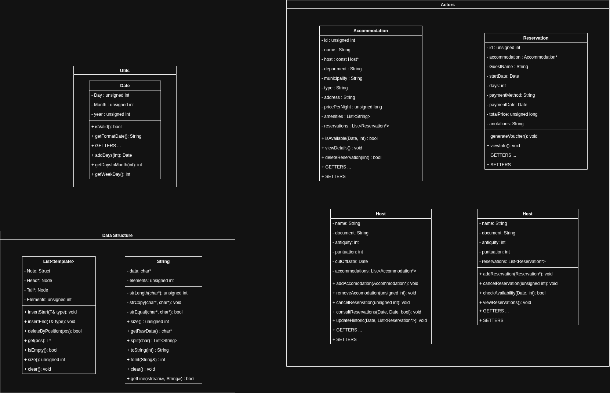

# Informe Técnico - Sistema de Gestión UdeAStay

**Desafío II - Informática II**  
**Universidad de Antioquia**  
**Semestre 2025-1**
**Ricardo Andres Ramirez Salagado**

---

## 1. Análisis del Problema y Consideraciones para la Solución Propuesta

### 1.1 Contexto del Problema

El sistema UdeAStay representa un mercado de estadías hogareñas que permite la gestión integral de alojamientos, reservaciones, anfitriones y huéspedes. El problema principal radica en modelar las relaciones entre estas entidades y garantizar la integridad de los datos durante las operaciones de reserva y gestión.

### 1.2 Análisis de Requerimientos

**Entidades Principales Identificadas:**
- **Alojamientos**: Propiedades disponibles para renta 
- **Anfitriones**: Propietarios que administran uno o más alojamientos
- **Huéspedes**: Usuarios que realizan reservaciones
- **Reservaciones**: Transacciones que conectan huéspedes con alojamientos
- **Fechas**: Sistema de gestión para disponibilidad

**Restricciones:**
- Un huésped no puede tener reservas superpuestas en fechas
- Los alojamientos deben estar disponibles durante todo el período de reserva
- Gestión de histórico de reservaciones pasadas
- Validación de integridad referencial entre entidades

### 1.3 Consideraciones de Diseño

**Decisiones Arquitecturales:**
1. **Eliminación de clases auxiliares**: Durante el desarrollo se eliminaron las clases `FileSystem` e `IdSystem` por simplicidad y eficiencia
2. **Gestión de archivos**: Se optó por funciones independientes en lugar de encapsulación en clase
3. **Generación de IDs**: Se implementó mediante funciones simples sin necesidad de clase dedicada
4. **Estructuras de datos**: Uso de listas enlazadas personalizadas sin STL

---

## 2. Diagrama de Clases de la Solución Planteada

### 2.1 Descripción de Clases Principales

**Clase Date:**
- Maneja la representación y validación de fechas
- Incluye operaciones de comparación y formato
- Validación de fechas y cálculos temporales

**Clase Accommodation:**
- Representa los alojamientos disponibles
- Gestiona amenidades, precios y disponibilidad
- Vinculación con anfitriones y reservaciones

**Clase Host:**
- Administra la información de anfitriones
- Gestiona múltiples alojamientos
- Control de puntuaciones y antigüedad

**Clase Guest:**
- Maneja información de huéspedes
- Control de reservaciones activas
- Validación de conflictos de fechas

**Clase Reservation:**
- Conecta huéspedes con alojamientos
- Gestiona períodos de reserva y pagos
- Incluye anotaciones del huésped

**Estructuras de Datos:**
- **List<template>**: Lista enlazada genérica para almacenamiento dinámico
- **String**: Clase personalizada para manejo de cadenas

### 2.2 Relaciones entre Clases

- **Host** → **Accommodation**: Un anfitrión puede tener múltiples alojamientos
- **Guest** → **Reservation** : Un huésped puede tener múltiples reservaciones
- **Accommodation** → **Reservation** : Un alojamiento puede tener múltiples reservaciones
- **Reservation** → **Date** : Cada reserva tiene fechas específicas

---

## 3. Descripción de Alto Nivel de algunos Subprogramas

### 3.1 Carga de Datos desde Archivos  
El sistema carga alojamientos desde un archivo de texto, leyendo línea por línea, separando los campos y creando objetos con la información. Se incluyen datos como nombre, ubicación, precio y amenidades. La complejidad es lineal respecto al número de líneas.

### 3.2 Validación y Búsqueda  
Antes de procesar una línea, se valida que tenga la cantidad esperada de campos. Para buscar un alojamiento por ID, se recorre la lista de forma secuencial. La validación es rápida (O(1)), pero la búsqueda es lineal (O(n)).

### 3.3 Guardado y Limpieza de Memoria  
El sistema permite guardar nuevamente los datos modificados en archivos y liberar la memoria al finalizar. Esto incluye alojamientos, reservaciones, anfitriones y huéspedes.

**Formato de Archivos Implementado:**

- **Alojamientos:** `ID|Nombre|Departamento|Municipio|Tipo|Dirección|Precio|Amenidades`
- **Reservaciones:** `ID|AlojamientoID|NombreHuésped|FechaInicio|Días|MétodoPago|FechaPago|PrecioTotal|Anotaciones`
- **Anfitriones:** `Nombre|Documento|Antigüedad|Puntuación|FechaCorte|IDsAlojamientos`
- **Huéspedes:** `Nombre|Documento|Antigüedad|Puntuación`

---

## 5. Problemas de Desarrollo Enfrentados

### 5.1 Problemas Técnicos

**Gestión de Memoria Dinámica:**
- **Problema**: Memory leaks en destructores de listas enlazadas
- **Solución**: Implementación cuidadosa de destructores
- **Impacto**: Estabilidad del sistema mejorada

**Validación de Integridad:**
- **Problema**: Reservaciones huérfanas tras eliminación de alojamientos
- **Solución**: Validación antes de eliminar entidades
- **Lección**: Importancia del diseño de restricciones

### 5.2 Problemas de Proceso

**Pérdida de Progreso:**
- **Situación**: Reset de git que eliminó trabajo de un día completo
- **Impacto**: Desmotivación temporal y retraso en cronograma
- **Aprendizaje**: Importancia de commits frecuentes y respaldos

**Déficit Teórico:**
- **Problema**: Conocimientos insuficientes en POO avanzada
- **Respuesta**: Estudio intensivo de conceptos como sobrecarga de operadores
- **Resultado**: Comprensión mejorada de paradigmas de programación

**Gestión del Tiempo:**
- **Desafío**: Plazo inicial restrictivo generó presión adicional
- **Adaptación**: Priorización de funcionalidades esenciales
- **Beneficio**: Mejores habilidades de planificación

---

## 6. Evolución de la Solución y Consideraciones de Implementación

### 6.1 Evolución del Diseño

**Versión Inicial:**
- Incluía clases `FileSystem` e `IdSystem`
- Diseño más complejo con mayor encapsulación
- Enfoque académico puro

**Versión Final:**
- Eliminación de clases innecesarias
- Funciones independientes para E/S de archivos
- Generación simple de IDs mediante contadores

**Justificación del Cambio:**
- Principio KISS (Keep It Simple, Stupid)
- Evitar over-engineering para problema específico
- Mejor rendimiento sin capas de abstracción innecesarias

### 6.2 Consideraciones de Eficiencia

**Optimizaciones Implementadas:**
1. **Búsqueda Temprana de Salida**: En validaciones, retorno inmediato al encontrar conflicto
2. **Reutilización de Objetos**: Evitar creación innecesaria de objetos temporales
3. **Referencias**: Se usaron de referencias para objetos grandes

### 6.3 Decisiones de Implementación

**Manejo de Archivos:**
- Formato de archivos diseñado para lectura secuencial eficiente
- Separación de datos activos e históricos
- Validación de integridad al cargar datos

**Interfaz de Usuario:**
- Menús jerárquicos para navegación intuitiva
- Validación de entrada
- Mensajes de error descriptivos

**Gestión de Errores:**
- Validaciones múltiples en cada operación crítica
- Rollback automático en caso de fallos
- Logging básico para depuración

---

## 7. Conclusiones

El desarrollo del sistema UdeAStay representó un desafío que permitió aplicar conceptos fundamentales de Programación Orientada a Objetos en un contexto realista(Como era su objetivo inicial). La evolución del diseño desde una propuesta inicial más compleja hacia una solución práctica y eficiente demuestra la importancia de la iteración y el refinamiento en el proceso de desarrollo.

Los principales logros incluyen:
- Implementación exitosa de todas las funcionalidades requeridas
- Diseño robusto de estructuras de datos personalizadas
- Gestión eficiente de memoria dinámica
- Sistema de validación integral

Las lecciones aprendidas enfatizan la importancia de:
- Planificación cuidadosa antes de la implementación
- Gestión adecuada del control de versiones
- Balance entre complejidad teórica y practicidad
- Importancia de pruebas continuas durante el desarrollo

Este proyecto fue algo que me entusiasmó bastante al pricipio. Sienta las bases para futuros desarrollos más complejos y demuestra la aplicabilidad de los principios de POO en la solución de problemas.

---

**Repositorio del Proyecto:** https://github.com/Ev3ert/UdeAStay  
**Fecha de Entrega:** 28 Mayo 2025
